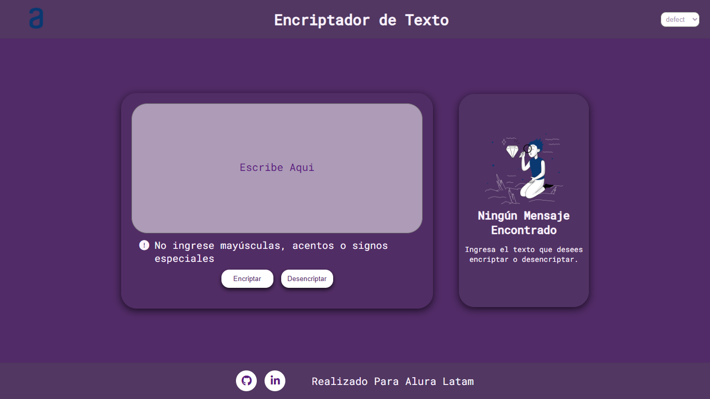
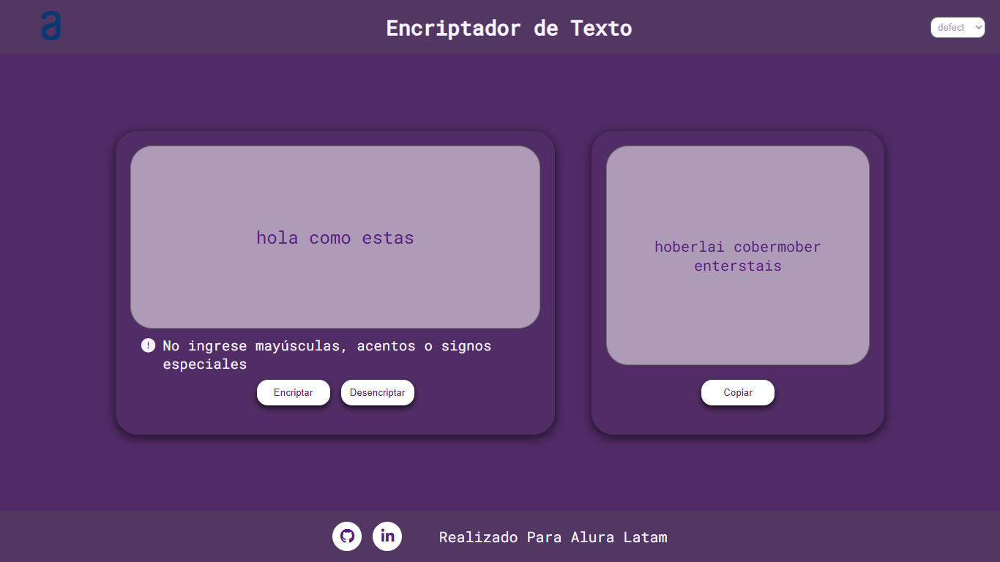
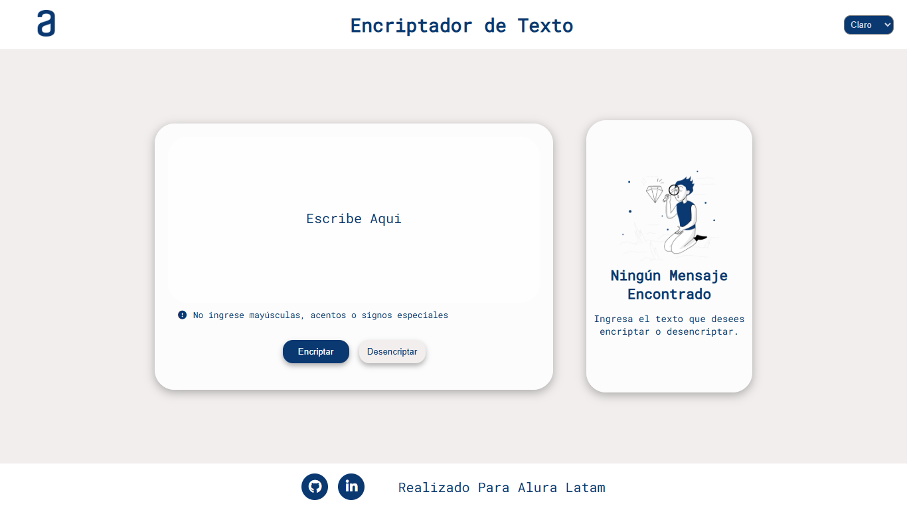
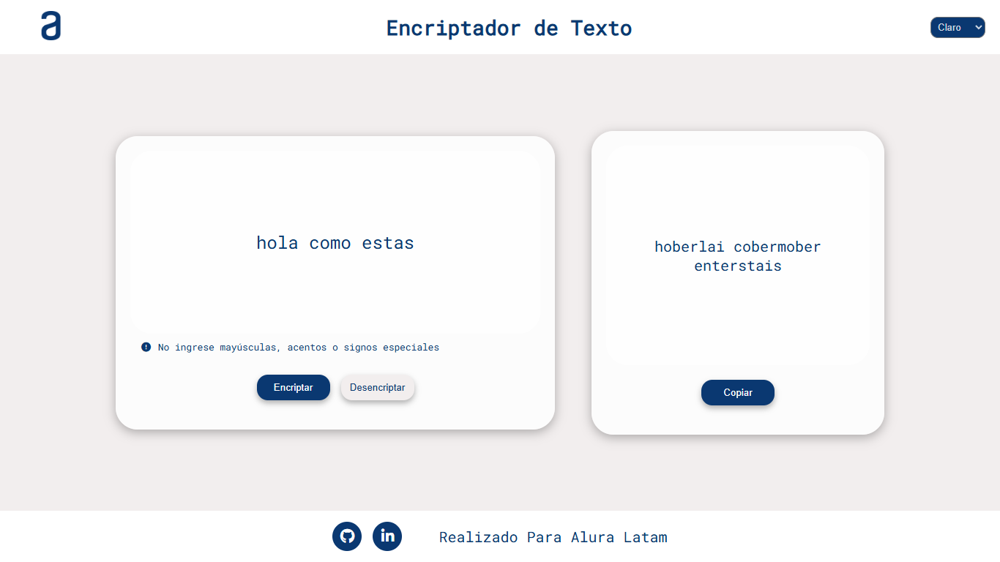
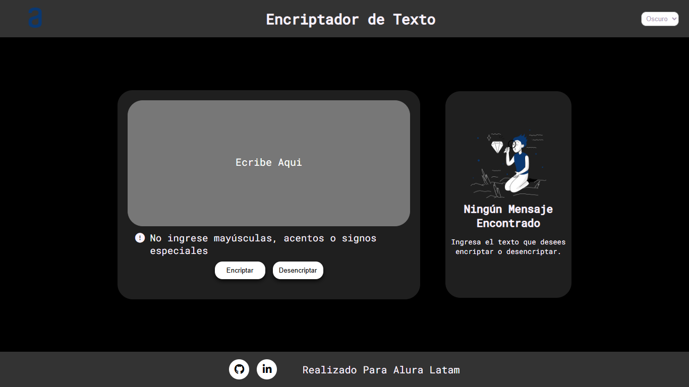
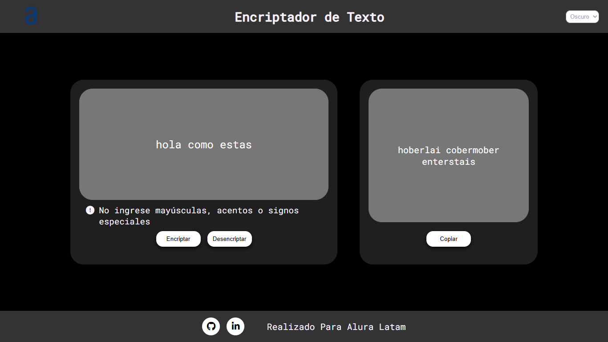
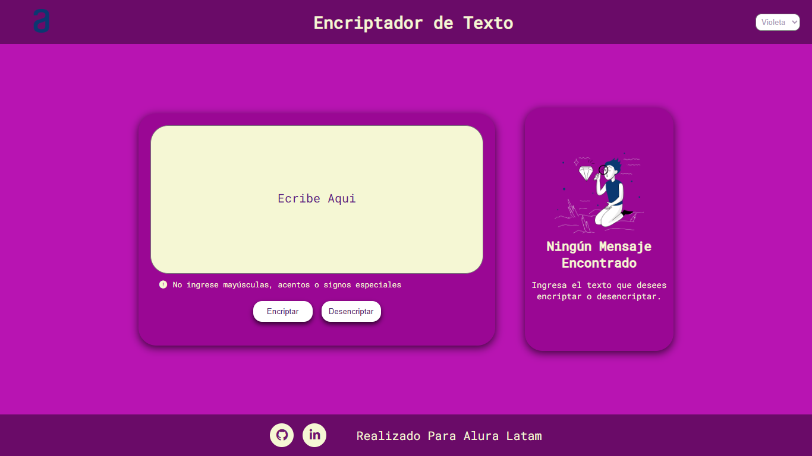
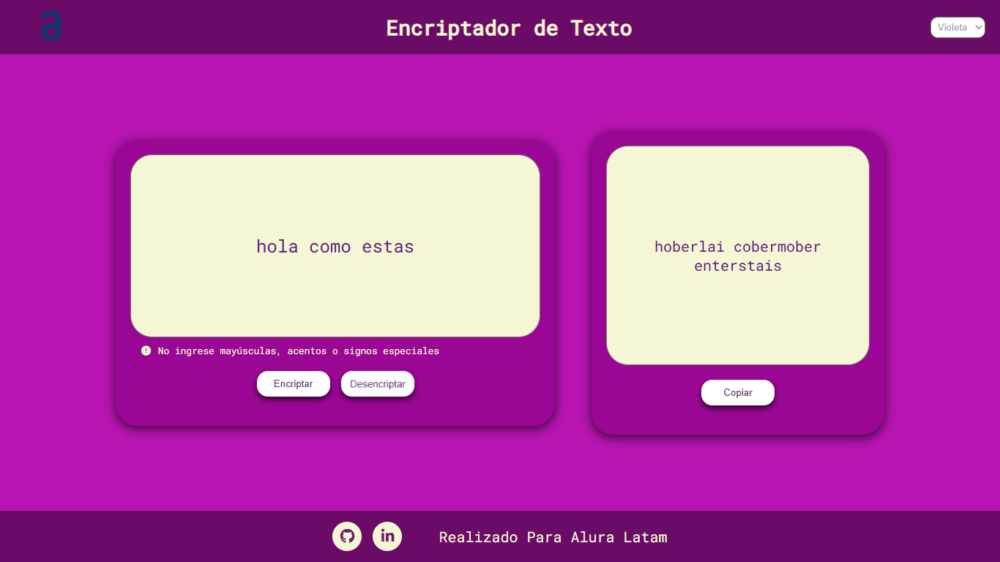

# Encriptador de Texto - Challenge ONE de Oracle+Alura LATAM

**Descripción:**

Este proyecto es un encriptador de texto simple desarrollado utilizando **HTML**, **CSS** y **JavaScript**. El objetivo del desafío es poner en práctica los conocimientos adquiridos en el curso "Principiante en programación" de Oracle+Alura LATAM.

## Desafío

Este desafío te permitirá practicar  mis habilidades en las siguientes áreas:

- **Desarrollo web**: Creación de una página web funcional con HTML, CSS y JavaScript.
- **Manejo de cadenas**: Manipulación de texto mediante JavaScript.
- **Interfaz de usuario**: Diseño de una interfaz sencilla y fácil de usar.

## Funcionalidades

- Permite al usuario ingresar un texto en letras minúsculas.
- Encripta el texto utilizando una tabla de equivalencias predefinida.
- Muestra el texto encriptado al usuario.
- Permite copiar el texto encriptado al portapapeles.

## Tecnologías Utilizadas

- **HTML**: Para la estructura básica de la página web.
- **CSS**: Para el estilo y la presentación de la interfaz de usuario.
- **JavaScript**: Para la lógica de encriptación y la interacción con el usuario.

## Capturas de Pantalla Interfaz Diferentes Temas

### Tema Default
### Interfaz Principal

### Texto Encriptado

### Tema Claro
### Interfaz Principal

### Texto Encriptado

### Tema Oscuro
### Interfaz Principal

### Texto Encriptado

### Tema Violeta
### Interfaz Principal

### Texto Encriptado

## Reflexiones Personales

Este proyecto ha sido una experiencia enriquecedora y un gran desafío. Aquí algunas de las cosas que aprendí:

- **Aplicación Práctica de Conceptos:** La implementación de la lógica de encriptación me permitió aplicar de manera práctica los conocimientos adquiridos en JavaScript, especialmente en la manipulación de cadenas y la interacción con el DOM.

- **Desarrollo de Interfaz de Usuario:** Diseñar y estilizar la interfaz me ayudó a mejorar mis habilidades en CSS, y a comprender mejor cómo crear una experiencia de usuario intuitiva y agradable.

- **Resolución de Problemas:** Enfrentar y resolver problemas de codificación me permitió desarrollar habilidades para depurar y optimizar el código.

Este reto no solo me ha permitido consolidar conocimientos técnicos, sino que también me ha dado una visión más clara de cómo integrar diferentes tecnologías para construir una aplicación funcional.

¡Espero que disfrutes explorando este proyecto tanto como yo disfruté creándolo!